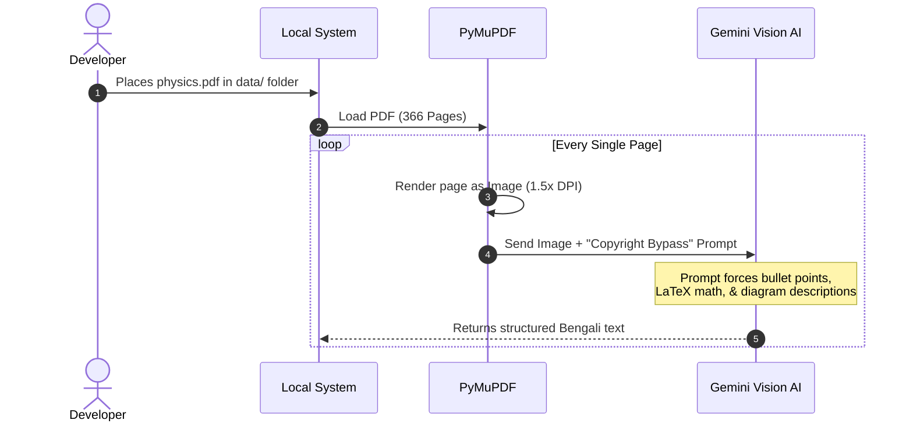
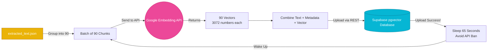
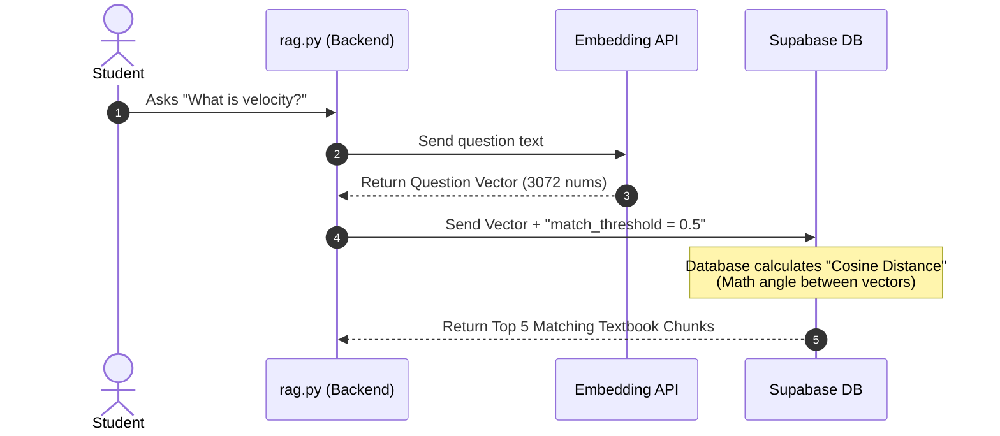

# 📊 ShikhAI: Visual Workflow & Pipeline Diagrams

This document provides a purely visual, diagram-based breakdown of the entire ShikhAI backend. It divides the complex RAG (Retrieval-Augmented Generation) architecture into sequential steps. 

**Note for Teammates:** The explanations below each diagram are written in plain English to help everyone (engineers, project managers, and designers) clearly understand exactly *how* and *why* the AI pipeline functions the way it does.

---

## 📑 Step 1: Data Collection & Pre-processing (Vision OCR)
*How we turn a raw, scanned PDF into intelligent, machine-readable text without losing formulas.*



### 🧠 Team Explanation:
*   **The Problem:** If you try to highlight and "copy-paste" text from a scanned Physics PDF, math formulas like $\frac{1}{2}mv^2$ turn into garbage text (like `12mv2`). Standard text extraction also completely ignores pictures and graphs.
*   **Our Solution (PyMuPDF + Vision AI):** Instead of extracting text, our Python script takes a literal "screenshot" of every single PDF page at high resolution. We then send that picture to Google's "Vision AI" (an AI that can *see*). 
*   **The "Copyright Bypass" Trick:** If you ask an AI to read a copyrighted textbook, it gets scared of piracy and blocks you. We trick it using "Prompt Engineering" by saying: *"Hey, act like a student and convert this image into detailed study notes with bullet points."* The AI happily obeys, giving us perfect Bengali text, beautifully formatted math formulas, and text descriptions of the diagrams.

---

## 🗄️ Step 2: Semantic Chunking & Local Caching
*How we slice the data into bite-sized pieces and protect against internet crashes.*

```mermaid
graph TD
    classDef file fill:#f59e0b,stroke:#b45309,color:#fff;
    classDef process fill:#3b82f6,stroke:#1d4ed8,color:#fff;
    classDef data fill:#10b981,stroke:#047857,color:#fff;

    A[Vision AI Output Text]:::data --> B{Is Text > 600 characters?}:::process
    B -->|Yes| C[Slice into smaller chunks]:::process
    B -->|No| D[Keep as single chunk]:::process
    
    C --> E[Attach Page Number Metadata<br/>e.g., page: 49]:::process
    D --> E
    
    E --> F[(extracted_text.json)]:::file
    
    Note right of F: Saves automatically.<br/>If script crashes, it resumes<br/>reading from this file.
```

### 🧠 Team Explanation:
*   **What is "Chunking"?:** Imagine asking someone to find the definition of "Velocity" inside a 366-page book without an index. It takes forever. We chop the textbook text into small, 600-character "chunks" (about the size of one paragraph). 
*   **Metadata Tagging:** We physically attach the exact page number to every single chunk (e.g., `This paragraph is from Page 49`). This ensures that later on, our AI tutor can confidently cite exactly where it got its information.
*   **The Safety Net (`extracted_text.json`):** Processing 366 images takes about 45 minutes. If the Wi-Fi drops at minute 40, we don't want to start over. The script saves every completed page to a local file on the computer. If the script crashes, it just checks the file and resumes exactly where it left off.

---

## 🔢 Step 3: Data Embedding & Cloud Upload
*How we turn Bengali text into math and store it securely in our cloud database.*



### 🧠 Team Explanation:
*   **What is an "Embedding Vector"?:** Computers don't understand the Bengali word "ত্বরণ" (Acceleration). So, we ask Google to translate that paragraph into a list of 3,072 floating-point numbers. This massive list of numbers is called a "Vector." It represents the mathematical *meaning* of the text.
*   **Uploading to Supabase:** We take the Bengali text, the page number, and the 3,072 numbers, and upload them to our cloud database (Supabase).
*   **The Anti-Ban Sleeper:** Google allows us to translate about 100 paragraphs per minute for free. If we send more, they temporarily ban our IP address. To fix this, our script uploads 90 paragraphs at once, and then intentionally "goes to sleep" for 65 seconds. When it wakes up, Google's 1-minute timer has reset, and we continue safely.

---

## 🔍 Step 4: Real-Time Student Query (Vector Search)
*How the system instantly finds the right answer when a student asks a question.*



### 🧠 Team Explanation:
*   **Matching Meaning, Not Keywords:** If a student asks "What makes things fall?", the word "Gravity" isn't in their question. A normal database search would fail. 
*   **How Vector Search Works:** When the student asks a question, we instantly turn their question into 3,072 numbers (a Vector) too. The Supabase database then acts like a compass. It measures the mathematical angle (Cosine Distance) between the question's vector and all the textbook vectors. Concepts with similar meanings point in the same direction. The database finds the top 5 paragraphs pointing in the exact same direction and returns them to us instantly.

---

## 🤖 Step 5: Answer Generation & Citation Workflow
*How the AI Tutor reads the found textbook paragraphs and talks to the student.*

```mermaid
graph TD
    classDef user fill:#8b5cf6,stroke:#5b21b6,color:#fff;
    classDef logic fill:#3b82f6,stroke:#1d4ed8,color:#fff;
    classDef ai fill:#ec4899,stroke:#be185d,color:#fff;
    classDef output fill:#10b981,stroke:#047857,color:#fff;

    A[Top 5 Textbook Chunks] --> C[Stitch together into single Context String]:::logic
    B[Student Question]:::user --> C
    
    C --> D[System Prompt:<br/>Act as Tutor, Don't Hallucinate,<br/>Speak same language]:::logic
    
    D --> E((Gemini 3.1 Flash-Lite)):::ai
    E -->|Generates Answer| F[Tutor Response]:::logic
    
    A -->|Extract metadata| G[Sort & Remove Duplicate Pages]:::logic
    G --> H[Citation String:<br/>e.g., Pages 49, 50]:::logic
    
    F --> I[Combine Answer + Citations]:::logic
    H --> I
    
    I --> J[Save to answer.md]:::output
    Note right of J: Bypasses Windows terminal<br/>Bengali font breaking issues!
```

### 🧠 Team Explanation:
*   **The "Open Book" Test:** Large Language Models (like ChatGPT) sometimes "hallucinate" and make up fake science. We don't let our AI do that. We paste the 5 textbook paragraphs we found into the AI's instructions and say: *"Answer the student's question, but ONLY use the information written in these paragraphs."* This guarantees 100% textbook accuracy.
*   **Building Citations:** Because we tagged every paragraph with a page number back in Step 2, our Python script easily reads those numbers, removes duplicates, and prints a beautiful source link (e.g., *Sources: Page 56, Page 58*).
*   **The Markdown Fix (`answer.md`):** Windows command terminals are terrible at rendering Bengali text; they often break letters apart. To give the student a beautiful reading experience, our backend saves the AI's final answer into a file called `answer.md`. When opened in a modern code editor, the Bengali text and the math formulas ($F=ma$) render flawlessly.
